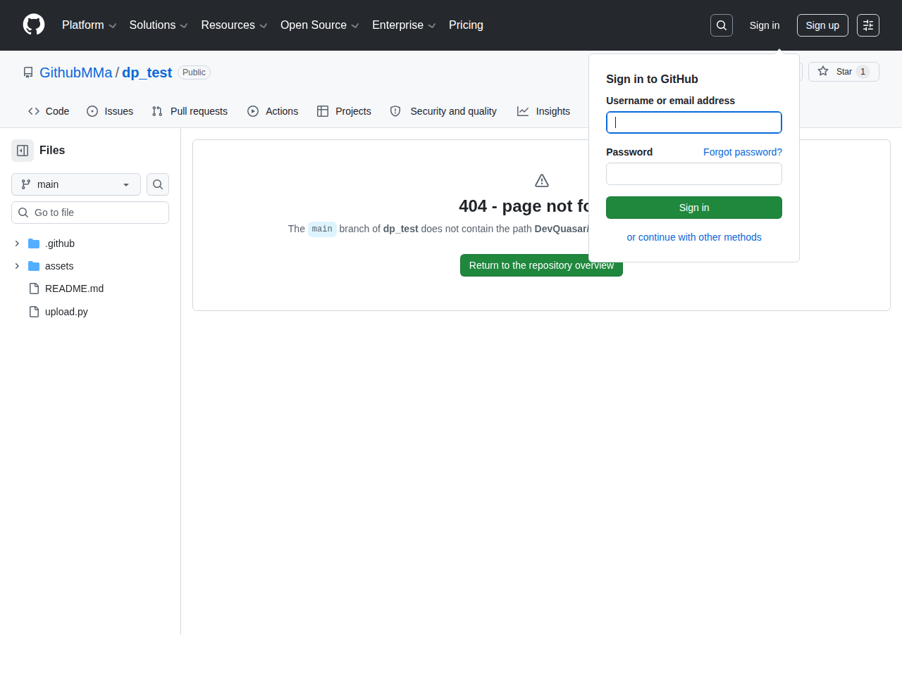

# Visited: https://github.com/GithubMMa/dp_test/blob/main/DevQuasar/CohereLabs.tiny-aya-earth-GGUF/tree/main
**Time:** Thu May  7 14:30:05 UTC 2026

## Screenshot

## Raw HTML
[page.html](./page.html)

## Downloaded Media (4 files)
## Downloaded Media Files

## Other Links
- [#start-of-content](#start-of-content)
- [/](/)
- [/GithubMMa](/GithubMMa)
- [/GithubMMa/dp_test](/GithubMMa/dp_test)
- [/GithubMMa/dp_test/actions](/GithubMMa/dp_test/actions)
- [/GithubMMa/dp_test/issues](/GithubMMa/dp_test/issues)
- [/GithubMMa/dp_test/projects](/GithubMMa/dp_test/projects)
- [/GithubMMa/dp_test/pulls](/GithubMMa/dp_test/pulls)
- [/GithubMMa/dp_test/pulse](/GithubMMa/dp_test/pulse)
- [/GithubMMa/dp_test/security](/GithubMMa/dp_test/security)
- [/login?return_to=%2FGithubMMa%2Fdp_test](/login?return_to=%2FGithubMMa%2Fdp_test)
- [/login?return_to=https%3A%2F%2Fgithub.com%2FGithubMMa%2Fdp_test%2Fblob%2Fmain%2FDevQuasar%2FCohereLabs.tiny-aya-earth-GGUF%2Ftree%2Fmain](/login?return_to=https%3A%2F%2Fgithub.com%2FGithubMMa%2Fdp_test%2Fblob%2Fmain%2FDevQuasar%2FCohereLabs.tiny-aya-earth-GGUF%2Ftree%2Fmain)
- [/manifest.json](/manifest.json)
- [/opensearch.xml](/opensearch.xml)
- [/password_reset](/password_reset)
- [/search/custom_scopes/check_name](/search/custom_scopes/check_name)
- [/signup?ref_cta=Sign+up&amp;ref_loc=header+logged+out&amp;ref_page=%2F%3Cuser-name%3E%2F%3Crepo-name%3E%2Fblob%2Fshow&amp;source=header-repo&amp;source_repo=GithubMMa%2Fdp_test](/signup?ref_cta=Sign+up&amp;ref_loc=header+logged+out&amp;ref_page=%2F%3Cuser-name%3E%2F%3Crepo-name%3E%2Fblob%2Fshow&amp;source=header-repo&amp;source_repo=GithubMMa%2Fdp_test)
- [https://archiveprogram.github.com](https://archiveprogram.github.com)
- [https://avatars.githubusercontent.com](https://avatars.githubusercontent.com)
- [https://docs.github.com](https://docs.github.com)
- [https://docs.github.com/](https://docs.github.com/)
- [https://docs.github.com/search-github/github-code-search/understanding-github-code-search-syntax](https://docs.github.com/search-github/github-code-search/understanding-github-code-search-syntax)
- [https://docs.github.com/site-policy/github-terms/github-terms-of-service](https://docs.github.com/site-policy/github-terms/github-terms-of-service)
- [https://docs.github.com/site-policy/privacy-policies/github-privacy-statement](https://docs.github.com/site-policy/privacy-policies/github-privacy-statement)
- [https://github-cloud.s3.amazonaws.com](https://github-cloud.s3.amazonaws.com)
- [https://github.blog](https://github.blog)
- [https://github.blog/changelog](https://github.blog/changelog)
- [https://github.com](https://github.com)
- [https://github.com/accelerator](https://github.com/accelerator)
- [https://github.com/collections](https://github.com/collections)
- [https://github.com/customer-stories](https://github.com/customer-stories)
- [https://github.com/enterprise](https://github.com/enterprise)
- [https://github.com/enterprise/startups](https://github.com/enterprise/startups)
- [https://github.com/features](https://github.com/features)
- [https://github.com/features/actions](https://github.com/features/actions)
- [https://github.com/features/code-review](https://github.com/features/code-review)
- [https://github.com/features/codespaces](https://github.com/features/codespaces)
- [https://github.com/features/copilot](https://github.com/features/copilot)
- [https://github.com/features/copilot/copilot-business](https://github.com/features/copilot/copilot-business)
- [https://github.com/features/issues](https://github.com/features/issues)
- [https://github.com/features/models](https://github.com/features/models)
- [https://github.com/features/spark](https://github.com/features/spark)
- [https://github.com/marketplace](https://github.com/marketplace)
- [https://github.com/mcp](https://github.com/mcp)
- [https://github.com/orgs/community/discussions](https://github.com/orgs/community/discussions)
- [https://github.com/partners](https://github.com/partners)
- [https://github.com/premium-support](https://github.com/premium-support)
- [https://github.com/pricing](https://github.com/pricing)
- [https://github.com/resources](https://github.com/resources)
- [https://github.com/resources/articles](https://github.com/resources/articles)

## Stats
- Links: 207
- Media: 4
