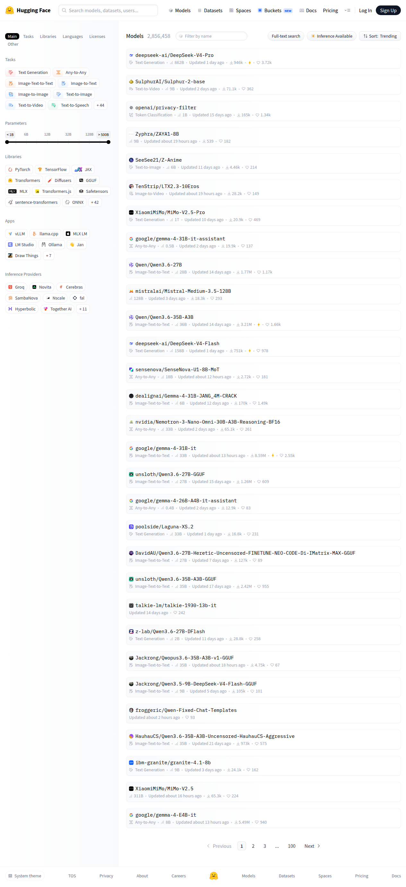

# Visited: https://huggingface.co/models
**Time:** Thu May  7 20:27:10 UTC 2026

## Screenshot

## Raw HTML
[page.html](./page.html)

## Downloaded Media (21 files)
## Downloaded Media Files

## Other Links
- [#](#)
- [#icon-drawthings-b](#icon-drawthings-b)
- [#linear-gradient](#linear-gradient)
- [/](/)
- [/DavidAU/Qwen3.6-27B-Heretic-Uncensored-FINETUNE-NEO-CODE-Di-IMatrix-MAX-GGUF](/DavidAU/Qwen3.6-27B-Heretic-Uncensored-FINETUNE-NEO-CODE-Di-IMatrix-MAX-GGUF)
- [/HauhauCS/Qwen3.6-35B-A3B-Uncensored-HauhauCS-Aggressive](/HauhauCS/Qwen3.6-35B-A3B-Uncensored-HauhauCS-Aggressive)
- [/Jackrong/Qwen3.5-9B-DeepSeek-V4-Flash-GGUF](/Jackrong/Qwen3.5-9B-DeepSeek-V4-Flash-GGUF)
- [/Jackrong/Qwopus3.6-35B-A3B-v1-GGUF](/Jackrong/Qwopus3.6-35B-A3B-v1-GGUF)
- [/Qwen/Qwen3.6-27B](/Qwen/Qwen3.6-27B)
- [/Qwen/Qwen3.6-35B-A3B](/Qwen/Qwen3.6-35B-A3B)
- [/SeeSee21/Z-Anime](/SeeSee21/Z-Anime)
- [/SulphurAI/Sulphur-2-base](/SulphurAI/Sulphur-2-base)
- [/TenStrip/LTX2.3-10Eros](/TenStrip/LTX2.3-10Eros)
- [/XiaomiMiMo/MiMo-V2.5](/XiaomiMiMo/MiMo-V2.5)
- [/XiaomiMiMo/MiMo-V2.5-Pro](/XiaomiMiMo/MiMo-V2.5-Pro)
- [/Zyphra/ZAYA1-8B](/Zyphra/ZAYA1-8B)
- [/datasets](/datasets)
- [/dealignai/Gemma-4-31B-JANG_4M-CRACK](/dealignai/Gemma-4-31B-JANG_4M-CRACK)
- [/deepseek-ai/DeepSeek-V4-Flash](/deepseek-ai/DeepSeek-V4-Flash)
- [/deepseek-ai/DeepSeek-V4-Pro](/deepseek-ai/DeepSeek-V4-Pro)
- [/docs](/docs)
- [/enterprise](/enterprise)
- [/froggeric/Qwen-Fixed-Chat-Templates](/froggeric/Qwen-Fixed-Chat-Templates)
- [/front/build/kube-87b6ff9/style.css](/front/build/kube-87b6ff9/style.css)
- [/google/gemma-4-26B-A4B-it-assistant](/google/gemma-4-26B-A4B-it-assistant)
- [/google/gemma-4-31B-it](/google/gemma-4-31B-it)
- [/google/gemma-4-31B-it-assistant](/google/gemma-4-31B-it-assistant)
- [/google/gemma-4-E4B-it](/google/gemma-4-E4B-it)
- [/huggingface](/huggingface)
- [/ibm-granite/granite-4.1-8b](/ibm-granite/granite-4.1-8b)
- [/join](/join)
- [/js/script.js](/js/script.js)
- [/login](/login)
- [/mistralai/Mistral-Medium-3.5-128B](/mistralai/Mistral-Medium-3.5-128B)
- [/models](/models)
- [/models?inference_provider=cerebras](/models?inference_provider=cerebras)
- [/models?inference_provider=fal-ai](/models?inference_provider=fal-ai)
- [/models?inference_provider=groq](/models?inference_provider=groq)
- [/models?inference_provider=hyperbolic](/models?inference_provider=hyperbolic)
- [/models?inference_provider=novita](/models?inference_provider=novita)
- [/models?inference_provider=nscale](/models?inference_provider=nscale)
- [/models?inference_provider=sambanova](/models?inference_provider=sambanova)
- [/models?inference_provider=together](/models?inference_provider=together)
- [/models?library=diffusers](/models?library=diffusers)
- [/models?library=gguf](/models?library=gguf)
- [/models?library=jax](/models?library=jax)
- [/models?library=mlx](/models?library=mlx)
- [/models?library=onnx](/models?library=onnx)
- [/models?library=pytorch](/models?library=pytorch)
- [/models?library=safetensors](/models?library=safetensors)

## Stats
- Links: 117
- Media: 21
