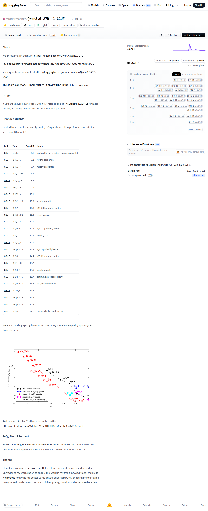
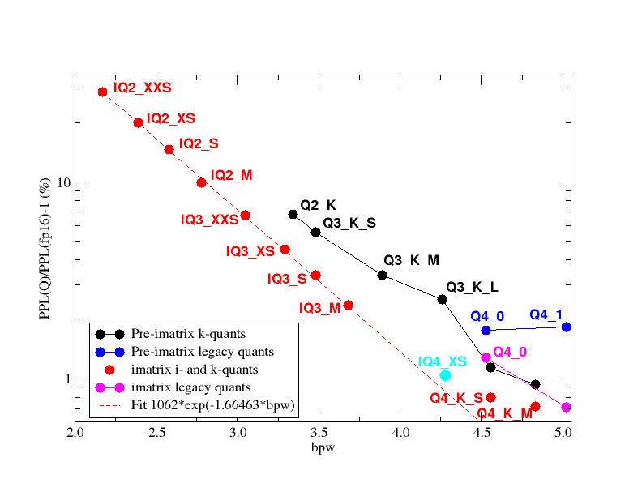

# Visited: https://huggingface.co/mradermacher/Qwen3.6-27B-i1-GGUF
**Time:** Fri May  8 00:01:54 UTC 2026

## Screenshot

## Raw HTML
[page.html](./page.html)

## Downloaded Media (1 files)
## Downloaded Media Files

## Other Links
- [#about](#about)
- [#faq--model-request](#faq--model-request)
- [#provided-quants](#provided-quants)
- [#thanks](#thanks)
- [#usage](#usage)
- [/](/)
- [/Qwen/Qwen3.6-27B](/Qwen/Qwen3.6-27B)
- [/datasets](/datasets)
- [/docs](/docs)
- [/docs/hub/model-cards#specifying-a-base-model](/docs/hub/model-cards#specifying-a-base-model)
- [/enterprise](/enterprise)
- [/front/build/kube-87b6ff9/style.css](/front/build/kube-87b6ff9/style.css)
- [/huggingface](/huggingface)
- [/join](/join)
- [/js/script.js](/js/script.js)
- [/login](/login)
- [/models](/models)
- [/models?language=en](/models?language=en)
- [/models?library=gguf](/models?library=gguf)
- [/models?library=transformers](/models?library=transformers)
- [/models?other=base_model:quantized:Qwen/Qwen3.6-27B](/models?other=base_model:quantized:Qwen/Qwen3.6-27B)
- [/models?other=conversational](/models?other=conversational)
- [/models?other=imatrix](/models?other=imatrix)
- [/mradermacher](/mradermacher)
- [/mradermacher/Qwen3.6-27B-i1-GGUF](/mradermacher/Qwen3.6-27B-i1-GGUF)
- [/mradermacher/Qwen3.6-27B-i1-GGUF/colab](/mradermacher/Qwen3.6-27B-i1-GGUF/colab)
- [/mradermacher/Qwen3.6-27B-i1-GGUF/discussions](/mradermacher/Qwen3.6-27B-i1-GGUF/discussions)
- [/mradermacher/Qwen3.6-27B-i1-GGUF/kaggle](/mradermacher/Qwen3.6-27B-i1-GGUF/kaggle)
- [/mradermacher/Qwen3.6-27B-i1-GGUF/tree/main](/mradermacher/Qwen3.6-27B-i1-GGUF/tree/main)
- [/mradermacher/Qwen3.6-27B-i1-GGUF?library=llama-cpp-python](/mradermacher/Qwen3.6-27B-i1-GGUF?library=llama-cpp-python)
- [/mradermacher/Qwen3.6-27B-i1-GGUF?library=transformers](/mradermacher/Qwen3.6-27B-i1-GGUF?library=transformers)
- [/mradermacher/Qwen3.6-27B-i1-GGUF?local-app=docker-model-runner](/mradermacher/Qwen3.6-27B-i1-GGUF?local-app=docker-model-runner)
- [/mradermacher/Qwen3.6-27B-i1-GGUF?local-app=lemonade](/mradermacher/Qwen3.6-27B-i1-GGUF?local-app=lemonade)
- [/mradermacher/Qwen3.6-27B-i1-GGUF?local-app=llama.cpp](/mradermacher/Qwen3.6-27B-i1-GGUF?local-app=llama.cpp)
- [/mradermacher/Qwen3.6-27B-i1-GGUF?local-app=ollama](/mradermacher/Qwen3.6-27B-i1-GGUF?local-app=ollama)
- [/mradermacher/Qwen3.6-27B-i1-GGUF?local-app=pi](/mradermacher/Qwen3.6-27B-i1-GGUF?local-app=pi)
- [/mradermacher/Qwen3.6-27B-i1-GGUF?local-app=unsloth](/mradermacher/Qwen3.6-27B-i1-GGUF?local-app=unsloth)
- [/pricing](/pricing)
- [/privacy](/privacy)
- [/settings/local-apps#local-apps](/settings/local-apps#local-apps)
- [/spaces](/spaces)
- [/spaces/huggingface/InferenceSupport/discussions/new?title=mradermacher/Qwen3.6-27B-i1-GGUF&amp;description=React%20to%20this%20comment%20with%20an%20emoji%20to%20vote%20for%20%5Bmradermacher%2FQwen3.6-27B-i1-GGUF%5D(%2Fmradermacher%2FQwen3.6-27B-i1-GGUF)%20to%20be%20supported%20by%20Inference%20Providers.%0A%0A(optional)%20Which%20providers%20are%20you%20interested%20in%3F%20(Novita%2C%20Hyperbolic%2C%20Together%E2%80%A6)%0A](/spaces/huggingface/InferenceSupport/discussions/new?title=mradermacher/Qwen3.6-27B-i1-GGUF&amp;description=React%20to%20this%20comment%20with%20an%20emoji%20to%20vote%20for%20%5Bmradermacher%2FQwen3.6-27B-i1-GGUF%5D(%2Fmradermacher%2FQwen3.6-27B-i1-GGUF)%20to%20be%20supported%20by%20Inference%20Providers.%0A%0A(optional)%20Which%20providers%20are%20you%20interested%20in%3F%20(Novita%2C%20Hyperbolic%2C%20Together%E2%80%A6)%0A)
- [/storage](/storage)
- [/terms-of-service](/terms-of-service)
- [https://apply.workable.com/huggingface/](https://apply.workable.com/huggingface/)
- [https://cdnjs.cloudflare.com/ajax/libs/KaTeX/0.12.0/katex.min.css](https://cdnjs.cloudflare.com/ajax/libs/KaTeX/0.12.0/katex.min.css)
- [https://de5282c3ca0c.edge.sdk.awswaf.com/de5282c3ca0c/526cf06acb0d/challenge.js](https://de5282c3ca0c.edge.sdk.awswaf.com/de5282c3ca0c/526cf06acb0d/challenge.js)
- [https://fonts.googleapis.com/css2?family=IBM+Plex+Mono:wght@400;600;700&display=swap](https://fonts.googleapis.com/css2?family=IBM+Plex+Mono:wght@400;600;700&display=swap)
- [https://fonts.googleapis.com/css2?family=Source+Sans+Pro:ital,wght@0,200;0,300;0,400;0,600;0,700;1,200;1,300;1,400;1,600;1,700&display=swap](https://fonts.googleapis.com/css2?family=Source+Sans+Pro:ital,wght@0,200;0,300;0,400;0,600;0,700;1,200;1,300;1,400;1,600;1,700&display=swap)
- [https://fonts.gstatic.com](https://fonts.gstatic.com)

## Stats
- Links: 90
- Media: 1
