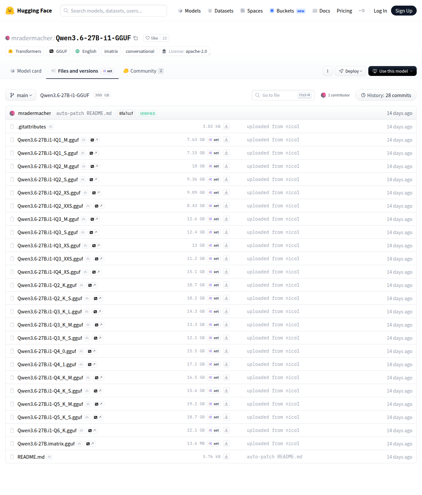

# Visited: https://huggingface.co/mradermacher/Qwen3.6-27B-i1-GGUF/tree/main
**Time:** Fri May  8 00:03:15 UTC 2026

## Screenshot

## Raw HTML
[page.html](./page.html)

## Downloaded Media (0 files)
_No media files downloaded_

## Other Links
- [/](/)
- [/datasets](/datasets)
- [/docs](/docs)
- [/enterprise](/enterprise)
- [/front/build/kube-87b6ff9/style.css](/front/build/kube-87b6ff9/style.css)
- [/join](/join)
- [/js/script.js](/js/script.js)
- [/login](/login)
- [/models](/models)
- [/models?language=en](/models?language=en)
- [/models?library=gguf](/models?library=gguf)
- [/models?library=transformers](/models?library=transformers)
- [/models?other=conversational](/models?other=conversational)
- [/models?other=imatrix](/models?other=imatrix)
- [/mradermacher](/mradermacher)
- [/mradermacher/Qwen3.6-27B-i1-GGUF](/mradermacher/Qwen3.6-27B-i1-GGUF)
- [/mradermacher/Qwen3.6-27B-i1-GGUF/blob/main/.gitattributes](/mradermacher/Qwen3.6-27B-i1-GGUF/blob/main/.gitattributes)
- [/mradermacher/Qwen3.6-27B-i1-GGUF/blob/main/Qwen3.6-27B.i1-IQ1_M.gguf](/mradermacher/Qwen3.6-27B-i1-GGUF/blob/main/Qwen3.6-27B.i1-IQ1_M.gguf)
- [/mradermacher/Qwen3.6-27B-i1-GGUF/blob/main/Qwen3.6-27B.i1-IQ1_S.gguf](/mradermacher/Qwen3.6-27B-i1-GGUF/blob/main/Qwen3.6-27B.i1-IQ1_S.gguf)
- [/mradermacher/Qwen3.6-27B-i1-GGUF/blob/main/Qwen3.6-27B.i1-IQ2_M.gguf](/mradermacher/Qwen3.6-27B-i1-GGUF/blob/main/Qwen3.6-27B.i1-IQ2_M.gguf)
- [/mradermacher/Qwen3.6-27B-i1-GGUF/blob/main/Qwen3.6-27B.i1-IQ2_S.gguf](/mradermacher/Qwen3.6-27B-i1-GGUF/blob/main/Qwen3.6-27B.i1-IQ2_S.gguf)
- [/mradermacher/Qwen3.6-27B-i1-GGUF/blob/main/Qwen3.6-27B.i1-IQ2_XS.gguf](/mradermacher/Qwen3.6-27B-i1-GGUF/blob/main/Qwen3.6-27B.i1-IQ2_XS.gguf)
- [/mradermacher/Qwen3.6-27B-i1-GGUF/blob/main/Qwen3.6-27B.i1-IQ2_XXS.gguf](/mradermacher/Qwen3.6-27B-i1-GGUF/blob/main/Qwen3.6-27B.i1-IQ2_XXS.gguf)
- [/mradermacher/Qwen3.6-27B-i1-GGUF/blob/main/Qwen3.6-27B.i1-IQ3_M.gguf](/mradermacher/Qwen3.6-27B-i1-GGUF/blob/main/Qwen3.6-27B.i1-IQ3_M.gguf)
- [/mradermacher/Qwen3.6-27B-i1-GGUF/blob/main/Qwen3.6-27B.i1-IQ3_S.gguf](/mradermacher/Qwen3.6-27B-i1-GGUF/blob/main/Qwen3.6-27B.i1-IQ3_S.gguf)
- [/mradermacher/Qwen3.6-27B-i1-GGUF/blob/main/Qwen3.6-27B.i1-IQ3_XS.gguf](/mradermacher/Qwen3.6-27B-i1-GGUF/blob/main/Qwen3.6-27B.i1-IQ3_XS.gguf)
- [/mradermacher/Qwen3.6-27B-i1-GGUF/blob/main/Qwen3.6-27B.i1-IQ3_XXS.gguf](/mradermacher/Qwen3.6-27B-i1-GGUF/blob/main/Qwen3.6-27B.i1-IQ3_XXS.gguf)
- [/mradermacher/Qwen3.6-27B-i1-GGUF/blob/main/Qwen3.6-27B.i1-IQ4_XS.gguf](/mradermacher/Qwen3.6-27B-i1-GGUF/blob/main/Qwen3.6-27B.i1-IQ4_XS.gguf)
- [/mradermacher/Qwen3.6-27B-i1-GGUF/blob/main/Qwen3.6-27B.i1-Q2_K.gguf](/mradermacher/Qwen3.6-27B-i1-GGUF/blob/main/Qwen3.6-27B.i1-Q2_K.gguf)
- [/mradermacher/Qwen3.6-27B-i1-GGUF/blob/main/Qwen3.6-27B.i1-Q2_K_S.gguf](/mradermacher/Qwen3.6-27B-i1-GGUF/blob/main/Qwen3.6-27B.i1-Q2_K_S.gguf)
- [/mradermacher/Qwen3.6-27B-i1-GGUF/blob/main/Qwen3.6-27B.i1-Q3_K_L.gguf](/mradermacher/Qwen3.6-27B-i1-GGUF/blob/main/Qwen3.6-27B.i1-Q3_K_L.gguf)
- [/mradermacher/Qwen3.6-27B-i1-GGUF/blob/main/Qwen3.6-27B.i1-Q3_K_M.gguf](/mradermacher/Qwen3.6-27B-i1-GGUF/blob/main/Qwen3.6-27B.i1-Q3_K_M.gguf)
- [/mradermacher/Qwen3.6-27B-i1-GGUF/blob/main/Qwen3.6-27B.i1-Q3_K_S.gguf](/mradermacher/Qwen3.6-27B-i1-GGUF/blob/main/Qwen3.6-27B.i1-Q3_K_S.gguf)
- [/mradermacher/Qwen3.6-27B-i1-GGUF/blob/main/Qwen3.6-27B.i1-Q4_0.gguf](/mradermacher/Qwen3.6-27B-i1-GGUF/blob/main/Qwen3.6-27B.i1-Q4_0.gguf)
- [/mradermacher/Qwen3.6-27B-i1-GGUF/blob/main/Qwen3.6-27B.i1-Q4_1.gguf](/mradermacher/Qwen3.6-27B-i1-GGUF/blob/main/Qwen3.6-27B.i1-Q4_1.gguf)
- [/mradermacher/Qwen3.6-27B-i1-GGUF/blob/main/Qwen3.6-27B.i1-Q4_K_M.gguf](/mradermacher/Qwen3.6-27B-i1-GGUF/blob/main/Qwen3.6-27B.i1-Q4_K_M.gguf)
- [/mradermacher/Qwen3.6-27B-i1-GGUF/blob/main/Qwen3.6-27B.i1-Q4_K_S.gguf](/mradermacher/Qwen3.6-27B-i1-GGUF/blob/main/Qwen3.6-27B.i1-Q4_K_S.gguf)
- [/mradermacher/Qwen3.6-27B-i1-GGUF/blob/main/Qwen3.6-27B.i1-Q5_K_M.gguf](/mradermacher/Qwen3.6-27B-i1-GGUF/blob/main/Qwen3.6-27B.i1-Q5_K_M.gguf)
- [/mradermacher/Qwen3.6-27B-i1-GGUF/blob/main/Qwen3.6-27B.i1-Q5_K_S.gguf](/mradermacher/Qwen3.6-27B-i1-GGUF/blob/main/Qwen3.6-27B.i1-Q5_K_S.gguf)
- [/mradermacher/Qwen3.6-27B-i1-GGUF/blob/main/Qwen3.6-27B.i1-Q6_K.gguf](/mradermacher/Qwen3.6-27B-i1-GGUF/blob/main/Qwen3.6-27B.i1-Q6_K.gguf)
- [/mradermacher/Qwen3.6-27B-i1-GGUF/blob/main/Qwen3.6-27B.imatrix.gguf](/mradermacher/Qwen3.6-27B-i1-GGUF/blob/main/Qwen3.6-27B.imatrix.gguf)
- [/mradermacher/Qwen3.6-27B-i1-GGUF/blob/main/README.md](/mradermacher/Qwen3.6-27B-i1-GGUF/blob/main/README.md)
- [/mradermacher/Qwen3.6-27B-i1-GGUF/colab](/mradermacher/Qwen3.6-27B-i1-GGUF/colab)
- [/mradermacher/Qwen3.6-27B-i1-GGUF/commit/08d9bf6dd45f8400fa7e3d9bd296b20df21b2ef3](/mradermacher/Qwen3.6-27B-i1-GGUF/commit/08d9bf6dd45f8400fa7e3d9bd296b20df21b2ef3)
- [/mradermacher/Qwen3.6-27B-i1-GGUF/commit/15aa7f2dea99462a5f4a2837f4fc493eef88a390](/mradermacher/Qwen3.6-27B-i1-GGUF/commit/15aa7f2dea99462a5f4a2837f4fc493eef88a390)
- [/mradermacher/Qwen3.6-27B-i1-GGUF/commit/1a2b70e7474016e6e9064079bf98b279dd483607](/mradermacher/Qwen3.6-27B-i1-GGUF/commit/1a2b70e7474016e6e9064079bf98b279dd483607)
- [/mradermacher/Qwen3.6-27B-i1-GGUF/commit/1a85fb546f0704d9a7936bfc9d5ed4e064934084](/mradermacher/Qwen3.6-27B-i1-GGUF/commit/1a85fb546f0704d9a7936bfc9d5ed4e064934084)
- [/mradermacher/Qwen3.6-27B-i1-GGUF/commit/1b7484bf5903a9937deb50b20bc42f9dc0dc6b96](/mradermacher/Qwen3.6-27B-i1-GGUF/commit/1b7484bf5903a9937deb50b20bc42f9dc0dc6b96)
- [/mradermacher/Qwen3.6-27B-i1-GGUF/commit/1c2fd7572cbbf410d314d11535616d6b1150785c](/mradermacher/Qwen3.6-27B-i1-GGUF/commit/1c2fd7572cbbf410d314d11535616d6b1150785c)
- [/mradermacher/Qwen3.6-27B-i1-GGUF/commit/31e54573c2ad30e111ce4516284067987836b88d](/mradermacher/Qwen3.6-27B-i1-GGUF/commit/31e54573c2ad30e111ce4516284067987836b88d)

## Stats
- Links: 120
- Media: 0
