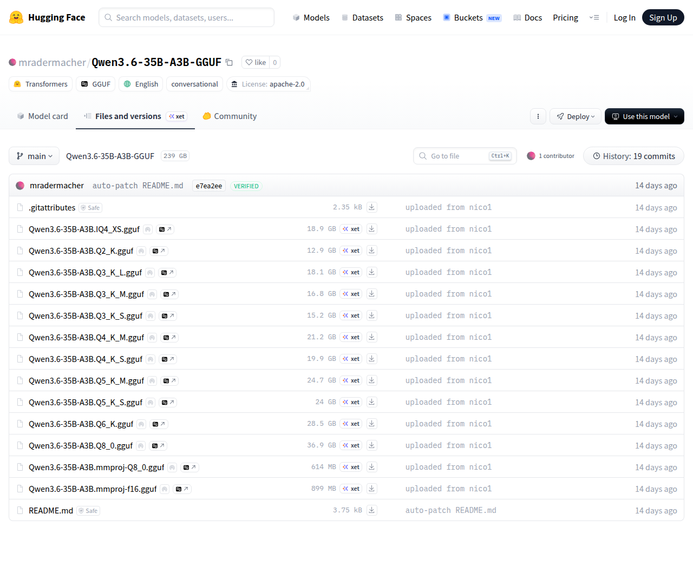

# Visited: https://huggingface.co/mradermacher/Qwen3.6-35B-A3B-GGUF/tree/main
**Time:** Fri May  8 00:12:12 UTC 2026

## Screenshot

## Raw HTML
[page.html](./page.html)

## Downloaded Media (0 files)
_No media files downloaded_

## Other Links
- [/](/)
- [/datasets](/datasets)
- [/docs](/docs)
- [/enterprise](/enterprise)
- [/front/build/kube-87b6ff9/style.css](/front/build/kube-87b6ff9/style.css)
- [/join](/join)
- [/js/script.js](/js/script.js)
- [/login](/login)
- [/models](/models)
- [/models?language=en](/models?language=en)
- [/models?library=gguf](/models?library=gguf)
- [/models?library=transformers](/models?library=transformers)
- [/models?other=conversational](/models?other=conversational)
- [/mradermacher](/mradermacher)
- [/mradermacher/Qwen3.6-35B-A3B-GGUF](/mradermacher/Qwen3.6-35B-A3B-GGUF)
- [/mradermacher/Qwen3.6-35B-A3B-GGUF/blob/main/.gitattributes](/mradermacher/Qwen3.6-35B-A3B-GGUF/blob/main/.gitattributes)
- [/mradermacher/Qwen3.6-35B-A3B-GGUF/blob/main/Qwen3.6-35B-A3B.IQ4_XS.gguf](/mradermacher/Qwen3.6-35B-A3B-GGUF/blob/main/Qwen3.6-35B-A3B.IQ4_XS.gguf)
- [/mradermacher/Qwen3.6-35B-A3B-GGUF/blob/main/Qwen3.6-35B-A3B.Q2_K.gguf](/mradermacher/Qwen3.6-35B-A3B-GGUF/blob/main/Qwen3.6-35B-A3B.Q2_K.gguf)
- [/mradermacher/Qwen3.6-35B-A3B-GGUF/blob/main/Qwen3.6-35B-A3B.Q3_K_L.gguf](/mradermacher/Qwen3.6-35B-A3B-GGUF/blob/main/Qwen3.6-35B-A3B.Q3_K_L.gguf)
- [/mradermacher/Qwen3.6-35B-A3B-GGUF/blob/main/Qwen3.6-35B-A3B.Q3_K_M.gguf](/mradermacher/Qwen3.6-35B-A3B-GGUF/blob/main/Qwen3.6-35B-A3B.Q3_K_M.gguf)
- [/mradermacher/Qwen3.6-35B-A3B-GGUF/blob/main/Qwen3.6-35B-A3B.Q3_K_S.gguf](/mradermacher/Qwen3.6-35B-A3B-GGUF/blob/main/Qwen3.6-35B-A3B.Q3_K_S.gguf)
- [/mradermacher/Qwen3.6-35B-A3B-GGUF/blob/main/Qwen3.6-35B-A3B.Q4_K_M.gguf](/mradermacher/Qwen3.6-35B-A3B-GGUF/blob/main/Qwen3.6-35B-A3B.Q4_K_M.gguf)
- [/mradermacher/Qwen3.6-35B-A3B-GGUF/blob/main/Qwen3.6-35B-A3B.Q4_K_S.gguf](/mradermacher/Qwen3.6-35B-A3B-GGUF/blob/main/Qwen3.6-35B-A3B.Q4_K_S.gguf)
- [/mradermacher/Qwen3.6-35B-A3B-GGUF/blob/main/Qwen3.6-35B-A3B.Q5_K_M.gguf](/mradermacher/Qwen3.6-35B-A3B-GGUF/blob/main/Qwen3.6-35B-A3B.Q5_K_M.gguf)
- [/mradermacher/Qwen3.6-35B-A3B-GGUF/blob/main/Qwen3.6-35B-A3B.Q5_K_S.gguf](/mradermacher/Qwen3.6-35B-A3B-GGUF/blob/main/Qwen3.6-35B-A3B.Q5_K_S.gguf)
- [/mradermacher/Qwen3.6-35B-A3B-GGUF/blob/main/Qwen3.6-35B-A3B.Q6_K.gguf](/mradermacher/Qwen3.6-35B-A3B-GGUF/blob/main/Qwen3.6-35B-A3B.Q6_K.gguf)
- [/mradermacher/Qwen3.6-35B-A3B-GGUF/blob/main/Qwen3.6-35B-A3B.Q8_0.gguf](/mradermacher/Qwen3.6-35B-A3B-GGUF/blob/main/Qwen3.6-35B-A3B.Q8_0.gguf)
- [/mradermacher/Qwen3.6-35B-A3B-GGUF/blob/main/Qwen3.6-35B-A3B.mmproj-Q8_0.gguf](/mradermacher/Qwen3.6-35B-A3B-GGUF/blob/main/Qwen3.6-35B-A3B.mmproj-Q8_0.gguf)
- [/mradermacher/Qwen3.6-35B-A3B-GGUF/blob/main/Qwen3.6-35B-A3B.mmproj-f16.gguf](/mradermacher/Qwen3.6-35B-A3B-GGUF/blob/main/Qwen3.6-35B-A3B.mmproj-f16.gguf)
- [/mradermacher/Qwen3.6-35B-A3B-GGUF/blob/main/README.md](/mradermacher/Qwen3.6-35B-A3B-GGUF/blob/main/README.md)
- [/mradermacher/Qwen3.6-35B-A3B-GGUF/colab](/mradermacher/Qwen3.6-35B-A3B-GGUF/colab)
- [/mradermacher/Qwen3.6-35B-A3B-GGUF/commit/23a74db26a5eda1225afae537aaf9241fc5e7faa](/mradermacher/Qwen3.6-35B-A3B-GGUF/commit/23a74db26a5eda1225afae537aaf9241fc5e7faa)
- [/mradermacher/Qwen3.6-35B-A3B-GGUF/commit/2db56f1d4be98059250cf3c9131cf1b6da997c3a](/mradermacher/Qwen3.6-35B-A3B-GGUF/commit/2db56f1d4be98059250cf3c9131cf1b6da997c3a)
- [/mradermacher/Qwen3.6-35B-A3B-GGUF/commit/3d7d2817c2a9bb146fbebb084e163955712c686e](/mradermacher/Qwen3.6-35B-A3B-GGUF/commit/3d7d2817c2a9bb146fbebb084e163955712c686e)
- [/mradermacher/Qwen3.6-35B-A3B-GGUF/commit/469c81d6a556ff29d023238428808a1c00a8e31e](/mradermacher/Qwen3.6-35B-A3B-GGUF/commit/469c81d6a556ff29d023238428808a1c00a8e31e)
- [/mradermacher/Qwen3.6-35B-A3B-GGUF/commit/631c3fe52a1430bad08a556b6f3c0683df3e7df0](/mradermacher/Qwen3.6-35B-A3B-GGUF/commit/631c3fe52a1430bad08a556b6f3c0683df3e7df0)
- [/mradermacher/Qwen3.6-35B-A3B-GGUF/commit/63d84143ae5a0bf91ce750a7af778a90f885f8fe](/mradermacher/Qwen3.6-35B-A3B-GGUF/commit/63d84143ae5a0bf91ce750a7af778a90f885f8fe)
- [/mradermacher/Qwen3.6-35B-A3B-GGUF/commit/68434d2b4709e6b75d38307f6ff2925fd5539d2c](/mradermacher/Qwen3.6-35B-A3B-GGUF/commit/68434d2b4709e6b75d38307f6ff2925fd5539d2c)
- [/mradermacher/Qwen3.6-35B-A3B-GGUF/commit/6b64385b87aede5b7fe4e2486ed18f6130f942b6](/mradermacher/Qwen3.6-35B-A3B-GGUF/commit/6b64385b87aede5b7fe4e2486ed18f6130f942b6)
- [/mradermacher/Qwen3.6-35B-A3B-GGUF/commit/ad030d856ae20f447cc2c9d72c7f4f8747ef3851](/mradermacher/Qwen3.6-35B-A3B-GGUF/commit/ad030d856ae20f447cc2c9d72c7f4f8747ef3851)
- [/mradermacher/Qwen3.6-35B-A3B-GGUF/commit/c09c42d50d284d7a44d20e2885151271427a347a](/mradermacher/Qwen3.6-35B-A3B-GGUF/commit/c09c42d50d284d7a44d20e2885151271427a347a)
- [/mradermacher/Qwen3.6-35B-A3B-GGUF/commit/cf7f788e658d8d9b208cadcfceca9d93f733a3e5](/mradermacher/Qwen3.6-35B-A3B-GGUF/commit/cf7f788e658d8d9b208cadcfceca9d93f733a3e5)
- [/mradermacher/Qwen3.6-35B-A3B-GGUF/commit/e7ea2ee70544360507f36ff9a8d8a7b48c67b64d](/mradermacher/Qwen3.6-35B-A3B-GGUF/commit/e7ea2ee70544360507f36ff9a8d8a7b48c67b64d)
- [/mradermacher/Qwen3.6-35B-A3B-GGUF/commit/f05af896d96d8dfcba4fccd91aa48d5d1ee33879](/mradermacher/Qwen3.6-35B-A3B-GGUF/commit/f05af896d96d8dfcba4fccd91aa48d5d1ee33879)
- [/mradermacher/Qwen3.6-35B-A3B-GGUF/commit/f70df48ebfedb1559620fa815fd0e210485b0df2](/mradermacher/Qwen3.6-35B-A3B-GGUF/commit/f70df48ebfedb1559620fa815fd0e210485b0df2)
- [/mradermacher/Qwen3.6-35B-A3B-GGUF/commits/main](/mradermacher/Qwen3.6-35B-A3B-GGUF/commits/main)
- [/mradermacher/Qwen3.6-35B-A3B-GGUF/discussions](/mradermacher/Qwen3.6-35B-A3B-GGUF/discussions)
- [/mradermacher/Qwen3.6-35B-A3B-GGUF/kaggle](/mradermacher/Qwen3.6-35B-A3B-GGUF/kaggle)
- [/mradermacher/Qwen3.6-35B-A3B-GGUF/resolve/main/.gitattributes?download=true](/mradermacher/Qwen3.6-35B-A3B-GGUF/resolve/main/.gitattributes?download=true)
- [/mradermacher/Qwen3.6-35B-A3B-GGUF/resolve/main/Qwen3.6-35B-A3B.IQ4_XS.gguf?download=true](/mradermacher/Qwen3.6-35B-A3B-GGUF/resolve/main/Qwen3.6-35B-A3B.IQ4_XS.gguf?download=true)

## Stats
- Links: 86
- Media: 0
