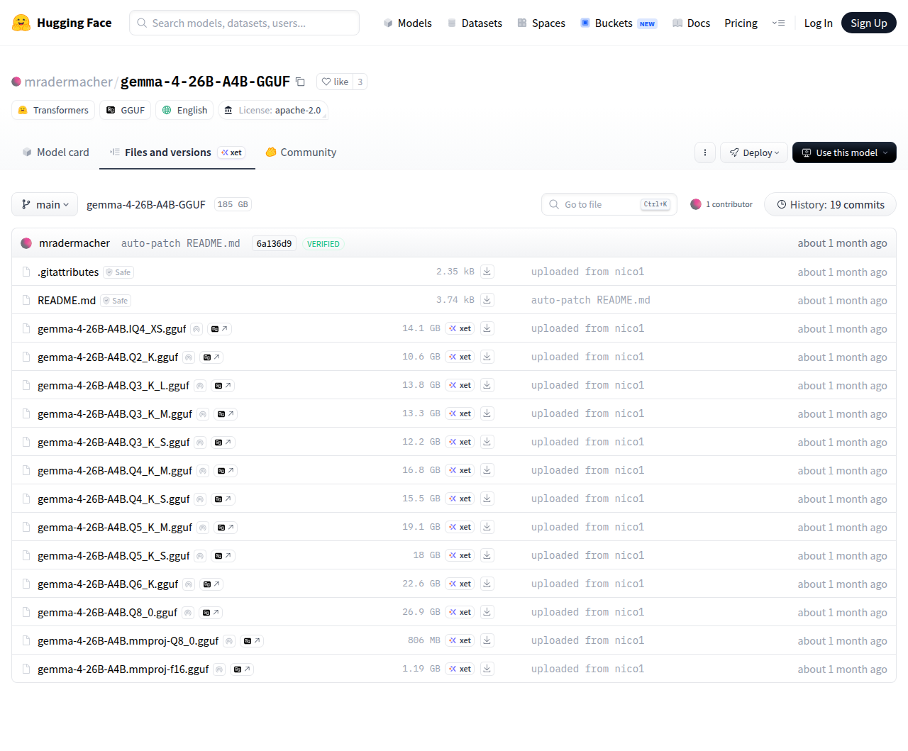

# Visited: https://huggingface.co/mradermacher/gemma-4-26B-A4B-GGUF/tree/main
**Time:** Fri May  8 00:22:46 UTC 2026

## Screenshot

## Raw HTML
[page.html](./page.html)

## Downloaded Media (0 files)
_No media files downloaded_

## Other Links
- [/](/)
- [/datasets](/datasets)
- [/docs](/docs)
- [/enterprise](/enterprise)
- [/front/build/kube-87b6ff9/style.css](/front/build/kube-87b6ff9/style.css)
- [/join](/join)
- [/js/script.js](/js/script.js)
- [/login](/login)
- [/models](/models)
- [/models?language=en](/models?language=en)
- [/models?library=gguf](/models?library=gguf)
- [/models?library=transformers](/models?library=transformers)
- [/mradermacher](/mradermacher)
- [/mradermacher/gemma-4-26B-A4B-GGUF](/mradermacher/gemma-4-26B-A4B-GGUF)
- [/mradermacher/gemma-4-26B-A4B-GGUF/blob/main/.gitattributes](/mradermacher/gemma-4-26B-A4B-GGUF/blob/main/.gitattributes)
- [/mradermacher/gemma-4-26B-A4B-GGUF/blob/main/README.md](/mradermacher/gemma-4-26B-A4B-GGUF/blob/main/README.md)
- [/mradermacher/gemma-4-26B-A4B-GGUF/blob/main/gemma-4-26B-A4B.IQ4_XS.gguf](/mradermacher/gemma-4-26B-A4B-GGUF/blob/main/gemma-4-26B-A4B.IQ4_XS.gguf)
- [/mradermacher/gemma-4-26B-A4B-GGUF/blob/main/gemma-4-26B-A4B.Q2_K.gguf](/mradermacher/gemma-4-26B-A4B-GGUF/blob/main/gemma-4-26B-A4B.Q2_K.gguf)
- [/mradermacher/gemma-4-26B-A4B-GGUF/blob/main/gemma-4-26B-A4B.Q3_K_L.gguf](/mradermacher/gemma-4-26B-A4B-GGUF/blob/main/gemma-4-26B-A4B.Q3_K_L.gguf)
- [/mradermacher/gemma-4-26B-A4B-GGUF/blob/main/gemma-4-26B-A4B.Q3_K_M.gguf](/mradermacher/gemma-4-26B-A4B-GGUF/blob/main/gemma-4-26B-A4B.Q3_K_M.gguf)
- [/mradermacher/gemma-4-26B-A4B-GGUF/blob/main/gemma-4-26B-A4B.Q3_K_S.gguf](/mradermacher/gemma-4-26B-A4B-GGUF/blob/main/gemma-4-26B-A4B.Q3_K_S.gguf)
- [/mradermacher/gemma-4-26B-A4B-GGUF/blob/main/gemma-4-26B-A4B.Q4_K_M.gguf](/mradermacher/gemma-4-26B-A4B-GGUF/blob/main/gemma-4-26B-A4B.Q4_K_M.gguf)
- [/mradermacher/gemma-4-26B-A4B-GGUF/blob/main/gemma-4-26B-A4B.Q4_K_S.gguf](/mradermacher/gemma-4-26B-A4B-GGUF/blob/main/gemma-4-26B-A4B.Q4_K_S.gguf)
- [/mradermacher/gemma-4-26B-A4B-GGUF/blob/main/gemma-4-26B-A4B.Q5_K_M.gguf](/mradermacher/gemma-4-26B-A4B-GGUF/blob/main/gemma-4-26B-A4B.Q5_K_M.gguf)
- [/mradermacher/gemma-4-26B-A4B-GGUF/blob/main/gemma-4-26B-A4B.Q5_K_S.gguf](/mradermacher/gemma-4-26B-A4B-GGUF/blob/main/gemma-4-26B-A4B.Q5_K_S.gguf)
- [/mradermacher/gemma-4-26B-A4B-GGUF/blob/main/gemma-4-26B-A4B.Q6_K.gguf](/mradermacher/gemma-4-26B-A4B-GGUF/blob/main/gemma-4-26B-A4B.Q6_K.gguf)
- [/mradermacher/gemma-4-26B-A4B-GGUF/blob/main/gemma-4-26B-A4B.Q8_0.gguf](/mradermacher/gemma-4-26B-A4B-GGUF/blob/main/gemma-4-26B-A4B.Q8_0.gguf)
- [/mradermacher/gemma-4-26B-A4B-GGUF/blob/main/gemma-4-26B-A4B.mmproj-Q8_0.gguf](/mradermacher/gemma-4-26B-A4B-GGUF/blob/main/gemma-4-26B-A4B.mmproj-Q8_0.gguf)
- [/mradermacher/gemma-4-26B-A4B-GGUF/blob/main/gemma-4-26B-A4B.mmproj-f16.gguf](/mradermacher/gemma-4-26B-A4B-GGUF/blob/main/gemma-4-26B-A4B.mmproj-f16.gguf)
- [/mradermacher/gemma-4-26B-A4B-GGUF/colab](/mradermacher/gemma-4-26B-A4B-GGUF/colab)
- [/mradermacher/gemma-4-26B-A4B-GGUF/commit/0cc8d5ea4d3d7d48189339bac41079ca6d47ba17](/mradermacher/gemma-4-26B-A4B-GGUF/commit/0cc8d5ea4d3d7d48189339bac41079ca6d47ba17)
- [/mradermacher/gemma-4-26B-A4B-GGUF/commit/618fb4d788c5887eed8dde56593020b6882de676](/mradermacher/gemma-4-26B-A4B-GGUF/commit/618fb4d788c5887eed8dde56593020b6882de676)
- [/mradermacher/gemma-4-26B-A4B-GGUF/commit/61b7bddc550e6088e972bdfdfa4d58fe4f9e0d14](/mradermacher/gemma-4-26B-A4B-GGUF/commit/61b7bddc550e6088e972bdfdfa4d58fe4f9e0d14)
- [/mradermacher/gemma-4-26B-A4B-GGUF/commit/6a136d923645de375ec008704d1d4875cac789e2](/mradermacher/gemma-4-26B-A4B-GGUF/commit/6a136d923645de375ec008704d1d4875cac789e2)
- [/mradermacher/gemma-4-26B-A4B-GGUF/commit/6c6463779f12328544df91e6e0909be3680558f6](/mradermacher/gemma-4-26B-A4B-GGUF/commit/6c6463779f12328544df91e6e0909be3680558f6)
- [/mradermacher/gemma-4-26B-A4B-GGUF/commit/70f6ddfd9ebf9c37f1339cb6de8746467c57dc96](/mradermacher/gemma-4-26B-A4B-GGUF/commit/70f6ddfd9ebf9c37f1339cb6de8746467c57dc96)
- [/mradermacher/gemma-4-26B-A4B-GGUF/commit/8d29080cf723dac88ce017a12f78dd3a8da85bb2](/mradermacher/gemma-4-26B-A4B-GGUF/commit/8d29080cf723dac88ce017a12f78dd3a8da85bb2)
- [/mradermacher/gemma-4-26B-A4B-GGUF/commit/91103ca90c3f1d605d75a2c0d6e61ed06d744a2e](/mradermacher/gemma-4-26B-A4B-GGUF/commit/91103ca90c3f1d605d75a2c0d6e61ed06d744a2e)
- [/mradermacher/gemma-4-26B-A4B-GGUF/commit/a203f29fec8c75088c996b48e271d76e053d27da](/mradermacher/gemma-4-26B-A4B-GGUF/commit/a203f29fec8c75088c996b48e271d76e053d27da)
- [/mradermacher/gemma-4-26B-A4B-GGUF/commit/c5580ecb8173c6678b32bac3658d143cd5221d9e](/mradermacher/gemma-4-26B-A4B-GGUF/commit/c5580ecb8173c6678b32bac3658d143cd5221d9e)
- [/mradermacher/gemma-4-26B-A4B-GGUF/commit/d69ffce515866630a66b4d98f1b803ee6c5ac20b](/mradermacher/gemma-4-26B-A4B-GGUF/commit/d69ffce515866630a66b4d98f1b803ee6c5ac20b)
- [/mradermacher/gemma-4-26B-A4B-GGUF/commit/dd62e6d8c5f51662c23747f2518c392c10e2e76c](/mradermacher/gemma-4-26B-A4B-GGUF/commit/dd62e6d8c5f51662c23747f2518c392c10e2e76c)
- [/mradermacher/gemma-4-26B-A4B-GGUF/commit/e2458013b0fe305780b317e094bd2314eee34307](/mradermacher/gemma-4-26B-A4B-GGUF/commit/e2458013b0fe305780b317e094bd2314eee34307)
- [/mradermacher/gemma-4-26B-A4B-GGUF/commit/e4c2f4057be3225c4df64dd048944f2dacd47906](/mradermacher/gemma-4-26B-A4B-GGUF/commit/e4c2f4057be3225c4df64dd048944f2dacd47906)
- [/mradermacher/gemma-4-26B-A4B-GGUF/commits/main](/mradermacher/gemma-4-26B-A4B-GGUF/commits/main)
- [/mradermacher/gemma-4-26B-A4B-GGUF/discussions](/mradermacher/gemma-4-26B-A4B-GGUF/discussions)
- [/mradermacher/gemma-4-26B-A4B-GGUF/kaggle](/mradermacher/gemma-4-26B-A4B-GGUF/kaggle)
- [/mradermacher/gemma-4-26B-A4B-GGUF/resolve/main/.gitattributes?download=true](/mradermacher/gemma-4-26B-A4B-GGUF/resolve/main/.gitattributes?download=true)
- [/mradermacher/gemma-4-26B-A4B-GGUF/resolve/main/README.md?download=true](/mradermacher/gemma-4-26B-A4B-GGUF/resolve/main/README.md?download=true)
- [/mradermacher/gemma-4-26B-A4B-GGUF/resolve/main/gemma-4-26B-A4B.IQ4_XS.gguf?download=true](/mradermacher/gemma-4-26B-A4B-GGUF/resolve/main/gemma-4-26B-A4B.IQ4_XS.gguf?download=true)

## Stats
- Links: 84
- Media: 0
