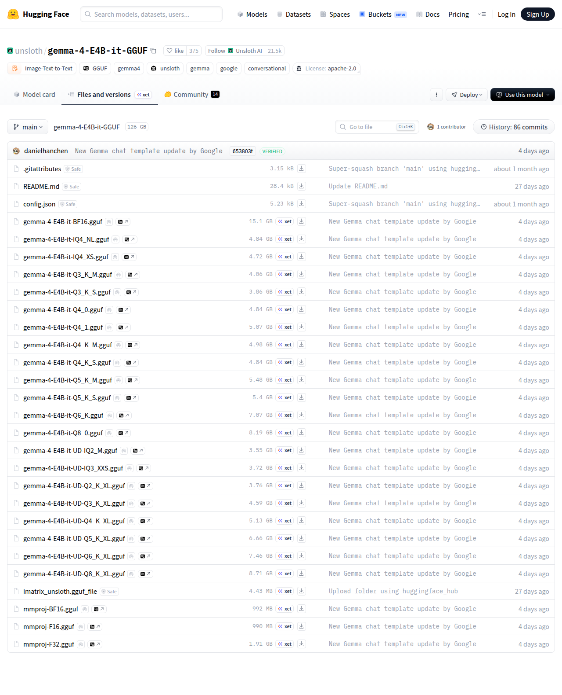

# Visited: https://huggingface.co/unsloth/gemma-4-E4B-it-GGUF/tree/main
**Time:** Fri May  8 01:54:54 UTC 2026

## Screenshot

## Raw HTML
[page.html](./page.html)

## Downloaded Media (2 files)
## Downloaded Media Files

## Other Links
- [/](/)
- [/danielhanchen](/danielhanchen)
- [/datasets](/datasets)
- [/docs](/docs)
- [/enterprise](/enterprise)
- [/front/build/kube-87b6ff9/style.css](/front/build/kube-87b6ff9/style.css)
- [/join](/join)
- [/js/script.js](/js/script.js)
- [/login](/login)
- [/models](/models)
- [/models?library=gguf](/models?library=gguf)
- [/models?other=conversational](/models?other=conversational)
- [/models?other=gemma](/models?other=gemma)
- [/models?other=gemma4](/models?other=gemma4)
- [/models?other=google](/models?other=google)
- [/models?other=unsloth](/models?other=unsloth)
- [/models?pipeline_tag=image-text-to-text](/models?pipeline_tag=image-text-to-text)
- [/pricing](/pricing)
- [/settings/local-apps#local-apps](/settings/local-apps#local-apps)
- [/spaces](/spaces)
- [/storage](/storage)
- [/unsloth](/unsloth)
- [/unsloth/gemma-4-E4B-it-GGUF](/unsloth/gemma-4-E4B-it-GGUF)
- [/unsloth/gemma-4-E4B-it-GGUF/blob/main/.gitattributes](/unsloth/gemma-4-E4B-it-GGUF/blob/main/.gitattributes)
- [/unsloth/gemma-4-E4B-it-GGUF/blob/main/README.md](/unsloth/gemma-4-E4B-it-GGUF/blob/main/README.md)
- [/unsloth/gemma-4-E4B-it-GGUF/blob/main/config.json](/unsloth/gemma-4-E4B-it-GGUF/blob/main/config.json)
- [/unsloth/gemma-4-E4B-it-GGUF/blob/main/gemma-4-E4B-it-BF16.gguf](/unsloth/gemma-4-E4B-it-GGUF/blob/main/gemma-4-E4B-it-BF16.gguf)
- [/unsloth/gemma-4-E4B-it-GGUF/blob/main/gemma-4-E4B-it-IQ4_NL.gguf](/unsloth/gemma-4-E4B-it-GGUF/blob/main/gemma-4-E4B-it-IQ4_NL.gguf)
- [/unsloth/gemma-4-E4B-it-GGUF/blob/main/gemma-4-E4B-it-IQ4_XS.gguf](/unsloth/gemma-4-E4B-it-GGUF/blob/main/gemma-4-E4B-it-IQ4_XS.gguf)
- [/unsloth/gemma-4-E4B-it-GGUF/blob/main/gemma-4-E4B-it-Q3_K_M.gguf](/unsloth/gemma-4-E4B-it-GGUF/blob/main/gemma-4-E4B-it-Q3_K_M.gguf)
- [/unsloth/gemma-4-E4B-it-GGUF/blob/main/gemma-4-E4B-it-Q3_K_S.gguf](/unsloth/gemma-4-E4B-it-GGUF/blob/main/gemma-4-E4B-it-Q3_K_S.gguf)
- [/unsloth/gemma-4-E4B-it-GGUF/blob/main/gemma-4-E4B-it-Q4_0.gguf](/unsloth/gemma-4-E4B-it-GGUF/blob/main/gemma-4-E4B-it-Q4_0.gguf)
- [/unsloth/gemma-4-E4B-it-GGUF/blob/main/gemma-4-E4B-it-Q4_1.gguf](/unsloth/gemma-4-E4B-it-GGUF/blob/main/gemma-4-E4B-it-Q4_1.gguf)
- [/unsloth/gemma-4-E4B-it-GGUF/blob/main/gemma-4-E4B-it-Q4_K_M.gguf](/unsloth/gemma-4-E4B-it-GGUF/blob/main/gemma-4-E4B-it-Q4_K_M.gguf)
- [/unsloth/gemma-4-E4B-it-GGUF/blob/main/gemma-4-E4B-it-Q4_K_S.gguf](/unsloth/gemma-4-E4B-it-GGUF/blob/main/gemma-4-E4B-it-Q4_K_S.gguf)
- [/unsloth/gemma-4-E4B-it-GGUF/blob/main/gemma-4-E4B-it-Q5_K_M.gguf](/unsloth/gemma-4-E4B-it-GGUF/blob/main/gemma-4-E4B-it-Q5_K_M.gguf)
- [/unsloth/gemma-4-E4B-it-GGUF/blob/main/gemma-4-E4B-it-Q5_K_S.gguf](/unsloth/gemma-4-E4B-it-GGUF/blob/main/gemma-4-E4B-it-Q5_K_S.gguf)
- [/unsloth/gemma-4-E4B-it-GGUF/blob/main/gemma-4-E4B-it-Q6_K.gguf](/unsloth/gemma-4-E4B-it-GGUF/blob/main/gemma-4-E4B-it-Q6_K.gguf)
- [/unsloth/gemma-4-E4B-it-GGUF/blob/main/gemma-4-E4B-it-Q8_0.gguf](/unsloth/gemma-4-E4B-it-GGUF/blob/main/gemma-4-E4B-it-Q8_0.gguf)
- [/unsloth/gemma-4-E4B-it-GGUF/blob/main/gemma-4-E4B-it-UD-IQ2_M.gguf](/unsloth/gemma-4-E4B-it-GGUF/blob/main/gemma-4-E4B-it-UD-IQ2_M.gguf)
- [/unsloth/gemma-4-E4B-it-GGUF/blob/main/gemma-4-E4B-it-UD-IQ3_XXS.gguf](/unsloth/gemma-4-E4B-it-GGUF/blob/main/gemma-4-E4B-it-UD-IQ3_XXS.gguf)
- [/unsloth/gemma-4-E4B-it-GGUF/blob/main/gemma-4-E4B-it-UD-Q2_K_XL.gguf](/unsloth/gemma-4-E4B-it-GGUF/blob/main/gemma-4-E4B-it-UD-Q2_K_XL.gguf)
- [/unsloth/gemma-4-E4B-it-GGUF/blob/main/gemma-4-E4B-it-UD-Q3_K_XL.gguf](/unsloth/gemma-4-E4B-it-GGUF/blob/main/gemma-4-E4B-it-UD-Q3_K_XL.gguf)
- [/unsloth/gemma-4-E4B-it-GGUF/blob/main/gemma-4-E4B-it-UD-Q4_K_XL.gguf](/unsloth/gemma-4-E4B-it-GGUF/blob/main/gemma-4-E4B-it-UD-Q4_K_XL.gguf)
- [/unsloth/gemma-4-E4B-it-GGUF/blob/main/gemma-4-E4B-it-UD-Q5_K_XL.gguf](/unsloth/gemma-4-E4B-it-GGUF/blob/main/gemma-4-E4B-it-UD-Q5_K_XL.gguf)
- [/unsloth/gemma-4-E4B-it-GGUF/blob/main/gemma-4-E4B-it-UD-Q6_K_XL.gguf](/unsloth/gemma-4-E4B-it-GGUF/blob/main/gemma-4-E4B-it-UD-Q6_K_XL.gguf)
- [/unsloth/gemma-4-E4B-it-GGUF/blob/main/gemma-4-E4B-it-UD-Q8_K_XL.gguf](/unsloth/gemma-4-E4B-it-GGUF/blob/main/gemma-4-E4B-it-UD-Q8_K_XL.gguf)
- [/unsloth/gemma-4-E4B-it-GGUF/blob/main/imatrix_unsloth.gguf_file](/unsloth/gemma-4-E4B-it-GGUF/blob/main/imatrix_unsloth.gguf_file)
- [/unsloth/gemma-4-E4B-it-GGUF/blob/main/mmproj-BF16.gguf](/unsloth/gemma-4-E4B-it-GGUF/blob/main/mmproj-BF16.gguf)
- [/unsloth/gemma-4-E4B-it-GGUF/blob/main/mmproj-F16.gguf](/unsloth/gemma-4-E4B-it-GGUF/blob/main/mmproj-F16.gguf)

## Stats
- Links: 107
- Media: 2
