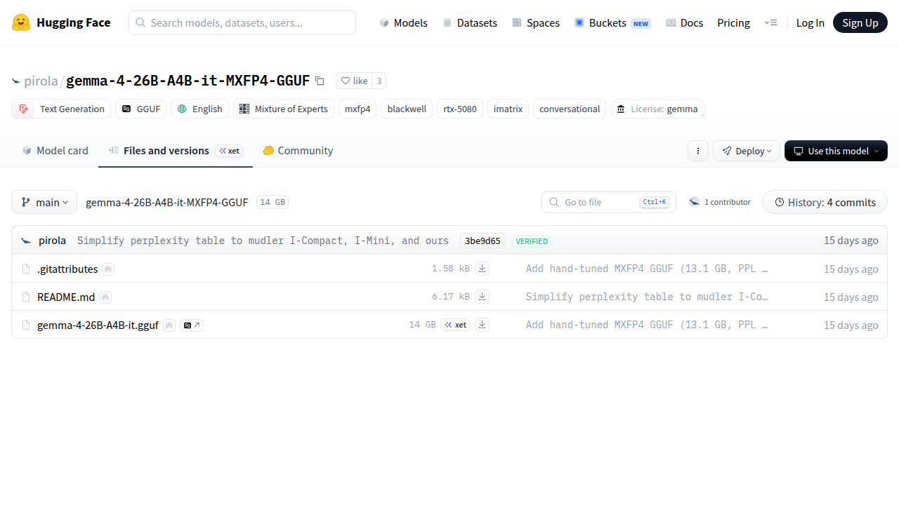

# Visited: https://huggingface.co/pirola/gemma-4-26B-A4B-it-MXFP4-GGUF/tree/main
**Time:** Tue May  5 17:00:35 UTC 2026

## Screenshot

## Raw HTML
[page.html](./page.html)

## Downloaded Media (1 files)
## Downloaded Media Files

## Other Links
- [/](/)
- [/datasets](/datasets)
- [/docs](/docs)
- [/enterprise](/enterprise)
- [/front/build/kube-ee38de4/style.css](/front/build/kube-ee38de4/style.css)
- [/join](/join)
- [/js/script.js](/js/script.js)
- [/login](/login)
- [/models](/models)
- [/models?language=en](/models?language=en)
- [/models?library=gguf](/models?library=gguf)
- [/models?other=blackwell](/models?other=blackwell)
- [/models?other=conversational](/models?other=conversational)
- [/models?other=imatrix](/models?other=imatrix)
- [/models?other=moe](/models?other=moe)
- [/models?other=mxfp4](/models?other=mxfp4)
- [/models?other=rtx-5080](/models?other=rtx-5080)
- [/models?pipeline_tag=text-generation](/models?pipeline_tag=text-generation)
- [/pirola](/pirola)
- [/pirola/gemma-4-26B-A4B-it-MXFP4-GGUF](/pirola/gemma-4-26B-A4B-it-MXFP4-GGUF)
- [/pirola/gemma-4-26B-A4B-it-MXFP4-GGUF/blob/main/.gitattributes](/pirola/gemma-4-26B-A4B-it-MXFP4-GGUF/blob/main/.gitattributes)
- [/pirola/gemma-4-26B-A4B-it-MXFP4-GGUF/blob/main/README.md](/pirola/gemma-4-26B-A4B-it-MXFP4-GGUF/blob/main/README.md)
- [/pirola/gemma-4-26B-A4B-it-MXFP4-GGUF/blob/main/gemma-4-26B-A4B-it.gguf](/pirola/gemma-4-26B-A4B-it-MXFP4-GGUF/blob/main/gemma-4-26B-A4B-it.gguf)
- [/pirola/gemma-4-26B-A4B-it-MXFP4-GGUF/commit/3be9d65bfd76917a1d49c791dd75a6d9aea7356e](/pirola/gemma-4-26B-A4B-it-MXFP4-GGUF/commit/3be9d65bfd76917a1d49c791dd75a6d9aea7356e)
- [/pirola/gemma-4-26B-A4B-it-MXFP4-GGUF/commit/934d6dfb631d0c71d9a530172c7b93df44cddc29](/pirola/gemma-4-26B-A4B-it-MXFP4-GGUF/commit/934d6dfb631d0c71d9a530172c7b93df44cddc29)
- [/pirola/gemma-4-26B-A4B-it-MXFP4-GGUF/commits/main](/pirola/gemma-4-26B-A4B-it-MXFP4-GGUF/commits/main)
- [/pirola/gemma-4-26B-A4B-it-MXFP4-GGUF/discussions](/pirola/gemma-4-26B-A4B-it-MXFP4-GGUF/discussions)
- [/pirola/gemma-4-26B-A4B-it-MXFP4-GGUF/resolve/main/.gitattributes?download=true](/pirola/gemma-4-26B-A4B-it-MXFP4-GGUF/resolve/main/.gitattributes?download=true)
- [/pirola/gemma-4-26B-A4B-it-MXFP4-GGUF/resolve/main/README.md?download=true](/pirola/gemma-4-26B-A4B-it-MXFP4-GGUF/resolve/main/README.md?download=true)
- [/pirola/gemma-4-26B-A4B-it-MXFP4-GGUF/resolve/main/gemma-4-26B-A4B-it.gguf?download=true](/pirola/gemma-4-26B-A4B-it-MXFP4-GGUF/resolve/main/gemma-4-26B-A4B-it.gguf?download=true)
- [/pirola/gemma-4-26B-A4B-it-MXFP4-GGUF/tree/main](/pirola/gemma-4-26B-A4B-it-MXFP4-GGUF/tree/main)
- [/pricing](/pricing)
- [/spaces](/spaces)
- [/storage](/storage)
- [https://cdnjs.cloudflare.com/ajax/libs/KaTeX/0.12.0/katex.min.css](https://cdnjs.cloudflare.com/ajax/libs/KaTeX/0.12.0/katex.min.css)
- [https://de5282c3ca0c.edge.sdk.awswaf.com/de5282c3ca0c/526cf06acb0d/challenge.js](https://de5282c3ca0c.edge.sdk.awswaf.com/de5282c3ca0c/526cf06acb0d/challenge.js)
- [https://fonts.googleapis.com/css2?family=IBM+Plex+Mono:wght@400;600;700&display=swap](https://fonts.googleapis.com/css2?family=IBM+Plex+Mono:wght@400;600;700&display=swap)
- [https://fonts.googleapis.com/css2?family=Source+Sans+Pro:ital,wght@0,200;0,300;0,400;0,600;0,700;1,200;1,300;1,400;1,600;1,700&display=swap](https://fonts.googleapis.com/css2?family=Source+Sans+Pro:ital,wght@0,200;0,300;0,400;0,600;0,700;1,200;1,300;1,400;1,600;1,700&display=swap)
- [https://fonts.gstatic.com](https://fonts.gstatic.com)
- [https://huggingface.co/pirola/gemma-4-26B-A4B-it-MXFP4-GGUF/tree/main](https://huggingface.co/pirola/gemma-4-26B-A4B-it-MXFP4-GGUF/tree/main)

## Stats
- Links: 42
- Media: 1
